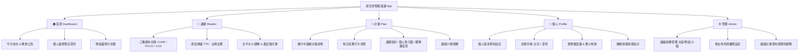

# 📖 新生命聖經速讀計畫 (NewLife Bible Speed Reading)
### 📱 隨身讀經打卡・社群關心互動・遊戲化成就系統

本專案為 **新生命小組教會（New Life Church, NLC）** 會友量身打造的聖經速讀 PWA（漸進式網頁應用程式）。整合 NLC (紟道) 生態系 SSO 登入，提供流暢的聖經閱讀、進度追蹤、團隊進度管理、靈修筆記寫作與小組社群關懷功能，以遊戲化的方式激勵會友一同建立每日讀經的好習慣。

---

## 🗺️ 系統介面與架構導覽

本應用程式採用單頁式應用（PWA）架構，主要包含以下五大功能區塊：



---

## 🚀 核心功能操作指引

以下針對系統的 6 大核心功能，提供詳細的操作步驟與設計機制說明：

### 1. 參與計畫
* **功能說明**：瀏覽並加入教會官方發布的季度速讀計畫，或建立個人自訂計畫，開始記錄讀經進度。
* **操作步驟**：
  1. 點擊底部導覽列的 **「計畫」** 頁籤。
  2. 系統會顯示「進行中計畫」與下方「可加入的計畫」清單。
  3. 選擇您想參與的計畫，點選右下角的 **「加入計畫」**（或點選 **「預先加入」**，針對尚未正式開始的計畫）。
  4. 系統將彈出「設定每週讀經安排」對話框，供您自訂進度。
  5. 點選 **「確認加入」** 後，系統將自動為您生成每日讀經章節清單，並可於計畫首頁開始打卡。
* > **💡 小撇步：** 
  > - **固定日期計畫**：教會官方的季度速讀計畫通常有明確的起訖日期，系統會自動在時間內平均分配章節。
  > - **非固定日期計畫**：自訂計畫無時間限制，系統會依據您勾選的讀經日，按順序為您每天安排進度。

### 2. 加入團隊
#### 🔹 新建團隊
* **功能說明**：小隊發起人（隊長）建立一個新的讀經團隊，並生成專屬邀請碼供隊員加入，共同組隊挑戰讀經。
* **操作步驟**：
  1. 進入 **「計畫」** 頁籤，點選您已加入的計畫進入詳情。
  2. 在團隊區塊中點選 **「查看讀經小隊」**。若該計畫您尚未有團隊，點選 **「＋ 建立團隊」**。
  3. 依序填入 **「團隊名稱」**（必填）、**「團隊簡介」**。
  4. 點選 **「確認建立」**，系統將即時在資料庫中註冊團隊，並在畫面上顯示一組 **6 位數專屬邀請碼**（如：`ABC123`）。
* > **💡 提示：** 
  > 建立團隊的創立者將自動成為「隊長」，擁有管理團隊名單、移出成員或解散團隊的權限。

#### 🔹 使用邀請碼加入
* **功能說明**：隊員輸入隊長分享的 6 位數邀請碼，加入指定讀經團隊，與隊友一同賽跑。
* **操作步驟**：
  1. 前往 **「計畫」** 頁籤的計畫詳情，在團隊區塊點選 **「加入團隊」**。
  2. 在彈出的輸入框中，輸入隊長分享的 **6 位數團隊邀請碼**。
  3. 系統會自動檢索並顯示該團隊的名稱、簡介及現有成員。
  4. 確認資訊無誤後，點選 **「加入」** 按鈕，即可完成與該團隊的綁定。
* > **💡 提示：** 
  > - 在同一個讀經計畫中，**一個帳號同時只能加入一個團隊**。若要換隊，請先請隊長將您移出目前團隊，或聯繫系統管理員協助。

### 3. 調整讀經休息日
* **功能說明**：根據個人的生活節奏，在設定中調整每週要讀經的天數及固定的休息日，系統將自動為您彈性重排章節。
* **操作步驟**：
  1. 進入 **「計畫」** 頁籤，點選右上角的 **「⋯」計畫選項** 圖示。
  2. 從選單中點選 **「調整讀經日」**。
  3. 在彈出視窗的 **「一週想讀經幾天」** 下拉選單中，選擇每週的讀經天數（1 到 7 天）。
  4. 在下方 **「固定休息星期」** 網格中，勾選您要作為休息日的星期（例如週六、週日）。
  5. 點選 **「儲存安排」**，系統會提示「每週讀經安排已更新，章節已重新分配」，並立即重新運算並更新進度表。
* > **💡 注意事項：** 
  > - 為確保計畫能在目標時間內完成，**一週至少需要保留 1 天讀經**，系統不允許將 7 天都設為休息日。
  > - 在休息日當天，計畫主畫面會顯示溫馨的 **「休息日橫幅」**（*「今天是補讀與休息日，好好親近神吧」*），此時可點擊補讀先前落後的章節。

### 4. 戳一下隊友
* **功能說明**：當隊友讀經進度落後或今天尚未打卡時，利用溫馨互動機制發送關懷提醒或打氣訊息。
* **操作步驟**：
  1. 進入 **「計畫」** 頁籤，點選 **「查看讀經小隊」** 查看成員進度列表。
  2. 瀏覽成員，在有落後或未打卡的隊友右側，點擊 **「戳一下（紙飛機/鈴鐺）」** 圖示。
  3. 系統將開啟 **「關心提醒」** 對話框，並自動依據其狀態（落後、久未打卡、進度穩定）自動推薦關心原因。
  4. 選擇關心類別：
     - **📉 進度落後**（落後時自動預設）
     - **😴 很久沒打卡**（多日未讀時自動預設）
     - **💛 一般關心**
     - **🌟 特別鼓勵**（對方進度超前時推薦使用）
  5. 系統會自動帶入對應的溫馨簡訊內容，您可以直接點擊傳送，或於框內修改自訂文字（長度限制 1 ~ 300 字）。
  6. 點選 **「傳送關心」**，送出後畫面下方會彈出 Toast 提示：*「已傳送關心提醒給 [隊友姓名] 💛」*。
* > **💡 注意事項（次數限制）：** 
  > - 為避免頻繁通知造成打擾，系統在資料庫層設有嚴格的限制：**同一個發送者每天只能對同一個隊友（就同一個計畫）發送一次關心提醒**（資料庫有每日唯一性限制）。再次點擊將會提示已達到每日上限。

### 5. 檢視組員狀況（管理權限/隊長視角）
* **功能說明**：供隊長、小組長、牧區長或系統管理員檢視所屬範圍內所有成員的讀經進度、出席狀況與詳細數據。
* **操作步驟**：
  - **隊長/組員視角（小隊內進度）**：
    1. 進入 **「計畫」** 頁籤，點選 **「查看讀經小隊」**。
    2. 成員名單中會以極具設計感的彩色進度條，顯示每位成員的累計讀經遍數、章節進度百分比以及最後閱讀時間。
  - **小組長/牧區長視角（跨組進度）**：
    1. 前往 **「計畫」** 頁籤的計畫詳情，點選 **「統計」** 子頁籤。
    2. 切換篩選範圍（個人 / 小組 / 牧區）。
    3. 系統會顯示 **「大區/牧區/小組排行表」**，並載入所有成員的詳細數據表（包含姓名、所屬小組、累計讀經章節、進度百分比、最後閱讀時間）。
    4. 當滑動到對應成員時，亦可點擊發起關懷提醒。
- > **💡 提示：** 
  > - 非管理職的一般會友僅能檢視同小隊的隊友百分比進度；具備小組長、牧區長或行政管理員權限的使用者，才能看到完整的跨組打卡名單與歷史統計圖表。

### 6. 白天 / 深色（晚上）模式切換
* **功能說明**：快速切換應用程式佈景主題，在強光下使用明亮主題，在夜間或暗處閱讀時切換為深色主題保護眼睛。
* **操作步驟**：
  1. 點選底部導覽列的 **「個人」** 分頁。
  2. 進入個人頁後，頂部導覽列右側會顯示 **「切換主題」**（太陽 / 月亮）按鈕（此按鈕在其他分頁會自動隱藏，以確保閱讀聖經時視覺的極簡無干擾）。
  3. 點擊該按鈕：
     - 若目前為白天，點擊後會轉換為 **深色模式（Dark Theme）**。
     - 若目前為深色，點擊後會轉換為 **白天模式（Light Theme）**。
* > **💡 小撇步：** 
  > - 主題設定會自動寫入瀏覽器的 `localStorage` 中，每次重新開啟應用程式時會自動沿用。
  > - **暖心褐色模式（Warm Sepia）**：在 **「讀經」** 閱讀器中，另提供專門為長時間看螢幕設計的「暖心褐色模式」，可與系統的白天/深色模式分開設定。

---

## ✨ 更多實用功能分析

除了上述核心功能外，本專案還包含以下豐富的輔助功能：

### 7. 沉浸式聖經閱讀與語音朗讀
* **功能說明**：提供心靈平靜、專注內容的讀經頁面，支援多譯本、字型縮放及台灣語音合成（TTS）朗讀。
* **操作步驟**：
  1. 點選底部導覽列的 **「讀經」** 分頁。
  2. 頂部工具列功能：
     - **譯本切換**：點擊譯本按鈕（如 CUNP），可在 **「新標點和合本 (CUNP)」**、**「和合本修訂版 (RCUV)」** 及 **「官話和合本 (CUV)」** 之間循環切換。
     - **字型大小**：點選 **「A+ / A-」** 即時縮放文字，提供最舒適的視覺大小。
     - **語音朗讀**：點擊 **「喇叭」** 圖示，系統會調用 Web Speech API，以流暢的台灣中文語音（`zh-TW`）自動為您朗讀整章聖經，再次點擊可隨時停止。
     - **螢光筆劃記**：長按或用滑鼠拖曳選取經文，即可為特定經文標記彩色螢光筆，劃記記錄會即時儲存至雲端。
* > **💡 小撇步：** 
  > 閱讀器在無網路連線時，會自動調用本地的聖經備份文字（`BIBLE_FALLBACK`），確保離線時閱讀不中斷。

### 8. 靈修心得寫作與牧區分享牆
* **功能說明**：在每日讀經任務完成後，記錄靈修心得，並可選擇將心得分享至所屬牧區，與弟兄姊妹在分享牆上互動、按讚、留言。
* **操作步驟**：
  1. 完成當日讀經任務後，在計畫首頁點選 **「寫靈修心得」**。
  2. 輸入您的心得內容。系統會透過專門的安全性防禦控制器（`DevotionalSharingController`）過濾任何惡意 HTML 標籤（XSS 防禦）。
  3. 勾選 **「分享到牧區分享牆」** 後點擊儲存。
  4. 儲存後，小組與牧區成員可在 **「首頁」** 的 **「牧區靈修分享牆」** 看到您的分享，並可對您的心得點擊 **「愛心按讚」** 或 **「回覆留言」**。
* > **💡 小撇步：** 
  > 個人首頁會特別統計您的 **「每日穩定靈修天數」**，幫助您記錄屬靈生命的穩定度。

### 9. 個人熱力圖與統計圖表
* **功能說明**：以視覺化的圖表與 Github 風格的讀經熱力圖（Heatmap），完整記錄並呈現您的讀經軌跡。
* **操作步驟**：
  1. 進入 **「計畫」** 分頁的計畫詳情，切換至 **「統計」** 子頁籤。
  2. 點選 **「個人統計」**：
     - **讀經熱力圖**：顯示過去 365 天每天的讀經打卡狀態，綠色格子越深代表當天讀經量越多。
     - **連續天數**：顯示目前的連續讀經天數（Streak）以及歷史最高紀錄，激勵您維持每日進度。
     - **完成百分比**：以 Chart.js 圓餅圖/進度條顯示目前計畫的總體完成率。
* > **💡 提示：** 
  > 熱力圖強度分為 5 個等級（monochrome ramp），隨著每日讀打卡章節數增加，顏色會從淺灰色漸進變為深綠色。

### 10. 遊戲化徽章牆與解鎖特效
* **功能說明**：透過豐富的遊戲化機制，當完成階段性計畫或特定挑戰時，會解鎖對應的榮譽徽章，並觸發全螢幕煙火特效。
* **操作步驟**：
  1. 當您勾選完某個計畫階段的最後一章聖經，系統會進行背景判定。
  2. 若判定成功晉級，畫面會即時解鎖專屬徽章（如：新生命聖經速讀計畫季度獎章），並在畫面上觸發 **Canvas 全螢幕粒子煙火特效（Fireworks）**。
  3. 解鎖的徽章會同步記錄在您的帳號中，您可隨時點選 **「個人」** 分頁 -> 切換至 **「徽章」** 頁籤，進入 **「我的榮譽徽章牆」** 檢視所有已解鎖與鎖定中的徽章細節與解鎖日期。

### 11. 離線讀經與背景自動同步 (Offline PWA)
* **功能說明**：支援無網路環境下的正常操作。在離線狀態下讀經與打卡，待恢復連線後，系統會自動在背景將進度同步回雲端資料庫。
* **操作步驟**：
  1. 當手機或電腦斷網時，頂部導覽列左側會自動亮起紅色的 **「離線模式」** 狀態燈（Connection Status Badge）。
  2. 您仍可照常使用 **「讀經」** 閱讀聖經，並在 **「計畫」** 中點選複選框進行每日打卡。
  3. 您的打卡記錄會被安全地暫存在瀏覽器的本地資料庫（IndexedDB）中。
  4. 當您的設備重新連接到網路時，狀態燈會變為綠色，系統的 `PwaCoordinator` 與背景同步（Background Sync）機制會自動把暫存的打卡日誌同步回 Supabase，無須手動重整。

---

## 🛠️ 開發與部署快速參考

如果您是教會的資訊同工（IT Personnel），想要在本地運行或部署此專案，請參考以下資訊：

### 本地開發步驟
1. **複製設定檔**：將根目錄的 `.env.example` 複製一份並命名為 `.env`。
2. **填寫 Supabase 與 SSO 參數**：
   ```env
   SUPABASE_URL=你的Supabase網址
   SUPABASE_ANON_KEY=你的Supabase Anon Key
   NLC_CLIENT_ID=你的SSO Client ID
   NLC_ISSUER=你的SSO授權端點
   ```
3. **生成 config.js**（每次修改環境變數後必須執行）：
   ```bash
   npm run build
   ```
4. **啟動開發伺服器**：
   ```bash
   npm run dev  # 預設會在本地啟動 npx serve，提供 PWA 靜態服務
   ```

### 架構與快取防禦機制（重要）
- **無打包工具**：本專案前台直接使用原生 JS/CSS，沒有 webpack/vite 等複雜打包，加載順序在 `index.html` 中有嚴格要求，請勿隨意更動 `<script>` 順序。
- **快取控制 (Cache-Busting)**：由於 PWA 在行動裝置上快取極為強烈，若修改了 JS 或 CSS 檔案，**務必更新 `index.html` 中對應引用的 `?v=版本號` 參數**，否則用戶端可能會加載到舊版代碼。

---

希望這份操作手冊能幫助您快速上手 **新生命聖經速讀計畫**！祝您讀經有得著，與弟兄姊妹一同在真道上長進！ 💛
